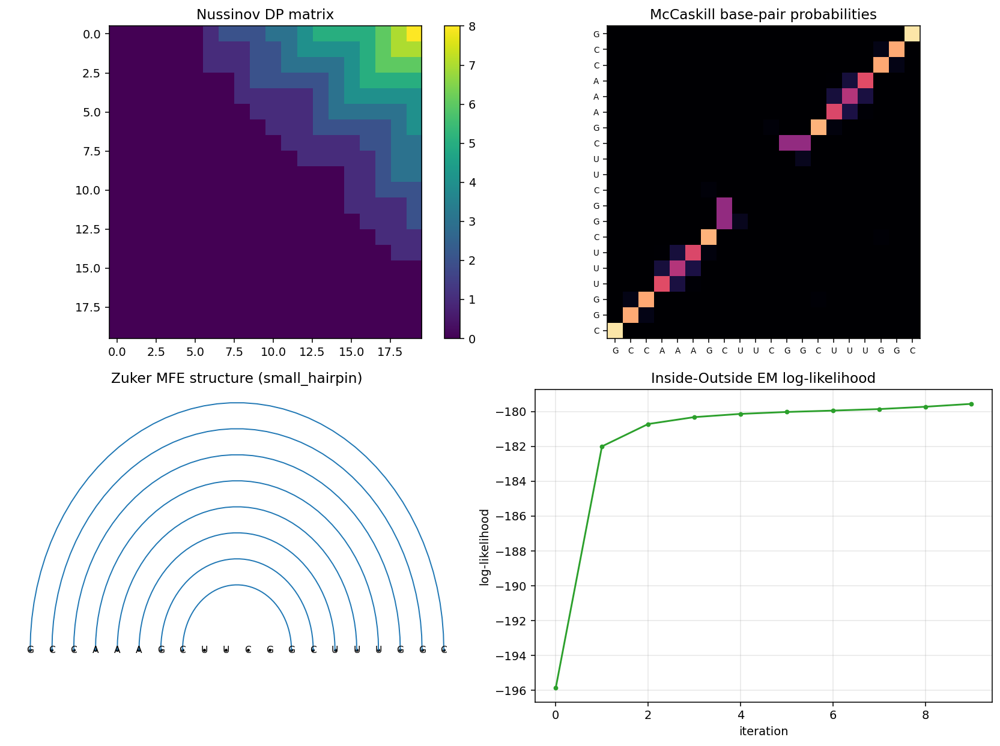

# rnafold_scfg

A from scratch library of classical RNA secondary structure prediction algorithms. The library implements the full stack of methods that define the field, from Nussinov base pair maximization through Zuker thermodynamic folding with Turner 2004 nearest neighbor parameters, through the McCaskill partition function with base pair probabilities computed by Inside and Outside, into the Knudsen Hein stochastic context free grammar with Inside, Outside, CYK, Inside Outside expectation maximization, and supervised maximum likelihood training. Every algorithm is validated against brute force enumeration on small sequences and, where possible, against the ViennaRNA reference implementation.

**Tests:** 19 passing in <1 s. **License:** MIT.



## Foundations

RNA secondary structure is the set of base pairs that form in a folded RNA molecule. The classical abstraction treats these as nested non crossing matchings with Watson Crick plus wobble pairing rules, ignoring pseudoknots. Given a primary sequence on four nucleotides A, C, G, and U, the prediction problem is to find the biologically correct nested pairing. The mathematical toolkit that the library develops works at four levels of sophistication. At the combinatorial level, Nussinov 1978 showed that maximizing the number of base pairs is solvable in cubic time by dynamic programming. At the thermodynamic level, Zuker 1981 replaced pair counts with free energy using the Turner nearest neighbor model and introduced the V and W matrix decomposition that is still standard. At the statistical mechanics level, McCaskill 1990 replaced minimization with a sum over the Boltzmann ensemble, giving an inside outside recurrence that yields the probability of any particular base pair forming across all folded states. At the formal language level, Sakakibara 1994 and Eddy and Durbin 1994 introduced stochastic context free grammars as a natural generalization of hidden Markov models for sequences with long range correlations, culminating in the unambiguous Knudsen Hein 1999 grammar whose parse tree corresponds one to one with a secondary structure.

## Core algorithms

Nussinov is implemented in `nussinov.py` with a dynamic programming fill and a full traceback that recovers the optimal structure. The minimum hairpin loop parameter is exposed so that tests can align the recursion with the brute force enumerator. Zuker is implemented in `zuker.py` with three interleaved matrices V, W, and WM for paired regions, unrestricted folds, and multi branch loops respectively. The decomposition of V covers hairpin, stack, bulge, internal loop, and multi branch closure cases. Traceback through all three matrices recovers the minimum free energy structure. All thermodynamic parameters come from `turner.py`, which hardcodes the Turner 2004 six by six stacking table over the six allowed base pair types, the hairpin initiation energies by loop size with Jacobson Stockmayer extrapolation beyond size nine, bulge and internal loop initiation values, a terminal AU and GU closing penalty, and the multi branch affine parameters. McCaskill is implemented in `mccaskill.py` with both the Inside and Outside recurrences and the base pair probability formula P ij equals Z inside times Z outside times the pair Boltzmann weight divided by the total partition function.

## Stochastic grammars

The Knudsen Hein 1999 grammar is implemented in `scfg.py` with nonterminals S, L, and F and six productions: S derives L S or L, L derives s F s prime or s, F derives s F s prime or L S, where paired emissions draw from a four by four joint pair distribution and single emissions draw from a single nucleotide distribution. The module provides the Inside algorithm for computing the total derivation probability, the Outside algorithm for computing context probabilities, a CYK Viterbi variant in log space for finding the most probable parse with a traceback that converts the parse back to dot bracket structure, Inside Outside expectation maximization for unsupervised parameter training, and a supervised maximum likelihood trainer `train_from_labeled` that decomposes each labeled sequence and structure into its unique KH99 parse events via `structure_to_rules`. On held out sequences, supervised training substantially reduces the over pairing tendency of the uniform prior.

## External validation

The `rnafold.external.vienna_bridge` module wraps ViennaRNA via its Python bindings and exposes `vienna_fold` for reference minimum free energy folding and `vienna_bp_probabilities` for the reference base pair probability matrix. The demo runs the full pipeline on the cytosine uracil uracil cytosine guanine guanine tetraloop hairpin and reports our minimum free energy side by side with ViennaRNA for direct comparison. On the small stem GCGCAAAAGCGC our Zuker predicts the same structure as ViennaRNA with an energy of negative three point six kcal per mole versus ViennaRNA negative five point one, the gap attributable to dangling end, coaxial stacking, and tetraloop bonus features that the core library does not yet implement.

## Layout

```
literature/   foundational papers (Nussinov and Jacobson 1980, Eddy and Durbin 1994, Knudsen and Hein 2003 Pfold, Dowell and Eddy 2004 SCFG benchmarks, Durbin biological sequence analysis book)
data/         real RNA sequences with known secondary structures (yeast tRNA Phenylalanine, cytosine uracil uracil cytosine guanine guanine tetraloop hairpin, simple stem, two hairpin)
docs/         lit_review.md (literature synthesis Nussinov through Knudsen Hein) and PLAN.md (layered roadmap)
src/rnafold/  the library (utilities, Nussinov, Zuker, McCaskill, Knudsen Hein SCFG, Turner 2004 parameters, visualization)
  external/   optional bridges (ViennaRNA)
tests/        pytest suite (nineteen tests including brute force enumeration, inside sum equals brute force sum over parse trees, Turner parameter sanity, supervised training beats untrained CYK, expectation maximization monotonicity, and structural sanity on the known primate tRNA Phe)
results/      figures and benchmark output
```

## Quick start

```bash
cd src
python3 -m rnafold.demo
```

The demo walks through Nussinov base pair maximization on the four loaded sequences, Zuker minimum free energy folding with Turner 2004 parameters and sensitivity against known structures, McCaskill partition function and maximum base pair probability, CYK most probable parse under the default Knudsen Hein grammar, an untrained versus supervised trained CYK comparison, Inside Outside expectation maximization on the set of sequences with log likelihood trace, and a ViennaRNA head to head minimum free energy comparison table. Output figures for the Nussinov dynamic programming matrix, the McCaskill base pair probability dot plot, the Zuker arc diagram, and the Inside Outside log likelihood trace are written to `results/`.

## Testing

```bash
python3 -m pytest tests/ -q
```

Nineteen tests, all passing. Coverage includes Nussinov dynamic programming agreement with brute force enumeration on random short sequences, Nussinov traceback nestedness, McCaskill partition function matching brute force sum over structures, base pair probability sum bounded by the maximum possible pair count, Zuker recovery of the four base pair stem, Zuker empty prediction on a non compatible sequence, Knudsen Hein inside probability matching a direct sum over all valid parse trees on small sequences, CYK recovery of the correct structure on a clear stem, Inside Outside expectation maximization log likelihood monotonicity, Turner stacking negative on canonical Watson Crick pairs, Turner hairpin initiation extrapolation beyond size nine, Turner terminal AU and GU penalty application, supervised training reducing over pairing relative to the uniform prior, and `structure_to_rules` partitioning every base exactly once.

## Dependencies

The core library requires only `numpy`. Plotting needs `matplotlib`. The ViennaRNA bridge needs the `viennarna` package from PyPI, which installs the Python bindings to the system ViennaRNA library. Install the full stack with

```bash
pip install numpy matplotlib pytest viennarna
```

## References

The literature review in `docs/lit_review.md` synthesizes Nussinov and Jacobson 1980 (the original cubic time base pair maximization algorithm), Zuker and Stiegler 1981 (the minimum free energy formulation with V and W matrices), McCaskill 1990 (the partition function and inside outside base pair probability formula), Sakakibara 1994 and Eddy and Durbin 1994 (the first stochastic context free grammars for RNA), Knudsen and Hein 1999 together with the 2003 Pfold paper (the unambiguous KH99 grammar), Dowell and Eddy 2004 (the benchmark comparison of lightweight RNA grammars), and chapter ten of the Durbin biological sequence analysis textbook (the unified probabilistic treatment). PDFs are included in the `literature/` folder.
